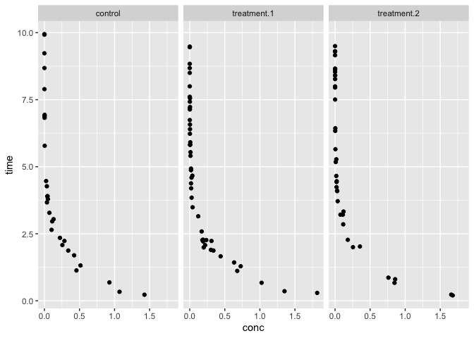
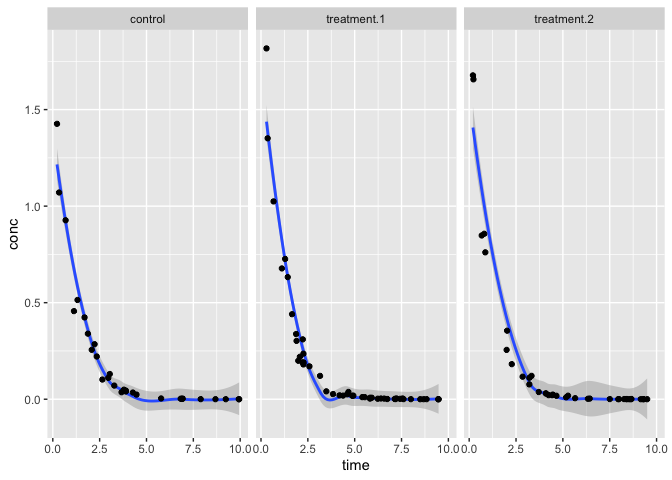
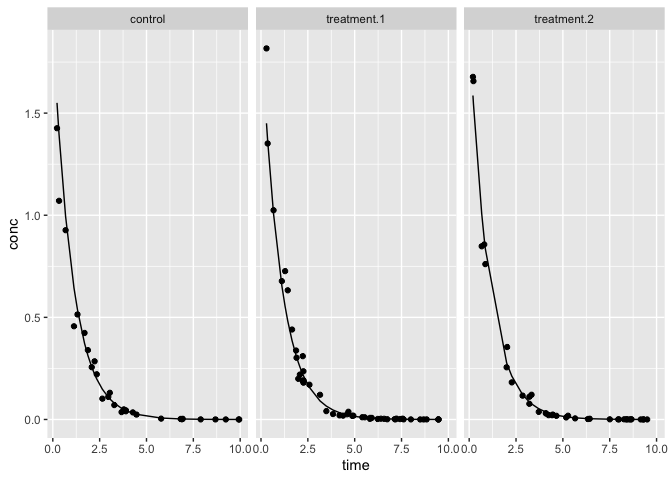

R Notebook
================

Loading in packages:

``` r
library(tidyverse)
library(nls2)
library(purrr)
library(dplyr)
library(modelr)
```

Loading in dataset:

``` r
d_unnested <- read.csv("fake_decay_data.csv") %>%
  rename(c("conc" ="y","time" = "x"))
```

Looking at dataset to observe trend

``` r
d_unnested %>%
  ggplot(aes(x=conc, y=time)) + 
  geom_point() +
  facet_wrap(~treatment)
```

<!-- -->

Creating function that tries to fit the NLS model to the data, and
returns NA if it can’t:

``` r
safe_fit <- function(df) {
  exp_formula <- formula(conc ~ A * exp(-k * time))
  
  the_fit <- tryCatch(
    nls2::nls2(formula = exp_formula,
               data = df,
               start = list(A= 0.6,
                            k = -0.09)),
    error = function(e) NA
  )
  the_fit
}
```

Creating a function to create an estimate for A and k if data is
available or returns NA if no data is available:

``` r
safely_get_A_estimate <- function(nls_obj) {
  # Check whether the object is NA or not
  if(!(is.na(nls_obj))[1]) { # This returns TRUE if the first element of the vector is not NA
    # The code to pull out the estimates for A
    A.estimate <- summary(nls_obj)$coefficients["A", "Estimate"]
  } else {
    # This gets triggered if the object is NA,
    # Which would have happened if the model fit didn't work
    A.estimate <- NA
  }
  A.estimate
}

safely_get_k_estimate <- function(nls_obj) {
  #browser()
  # Check whether the object is NA or not
  if(!(is.na(nls_obj))[1]) { # This returns TRUE if the first element of the vector is not NA
    # Here goes the code to pull out the estimates for A
    k.estimate <- summary(nls_obj)$coefficients["k", "Estimate"]
  } else {
    # This gets triggered if the object is NA,
    #   Which would have happened if the model fit didn't work
    k.estimate <- NA
  }
  k.estimate
}
```

Adding model fit and estimates for A and k to nested data-frame:

``` r
d_nested <- d_unnested %>%
  group_by(treatment, rep, site) %>%
  nest(data = c(conc, time)) %>%
  mutate(fits = map(data, safe_fit),
         A = map_dbl(fits, safely_get_A_estimate),
         k = map_dbl(fits, safely_get_k_estimate))
```

Unnesting and making plots of data points with model predictions - First
Attempt:

``` r
df_new <- unnest(d_nested, data)


df_new %>%
  ggplot(aes(x=time, y=conc)) +
  geom_smooth() +
  geom_point() + 
  facet_wrap(~treatment) +
  geom_smooth(method = "nls2", 
            method.args = list(formula = conc ~ A * exp(-k * time)),
            data = df_new,
            se = FALSE,
            method.args = list(start = list(k = safely_get_k_estimate(d_nested$fits), 
                                            A = safely_get_A_estimate(d_nested$fits)))
)
```

<!-- -->

Making plots of data points with model predictions - Second Attempt:

``` r
# Making exponential decay formula
m <- nls2(data = d_unnested, conc ~ A * exp(-k * time), start = list(A = 0.6, k = -0.09))

summary(m)
```

    ## 
    ## Formula: conc ~ A * exp(-k * time)
    ## 
    ## Parameters:
    ##   Estimate Std. Error t value Pr(>|t|)    
    ## A  1.92682    0.03912   49.25   <2e-16 ***
    ## k  0.96988    0.02611   37.15   <2e-16 ***
    ## ---
    ## Signif. codes:  0 '***' 0.001 '**' 0.01 '*' 0.05 '.' 0.1 ' ' 1
    ## 
    ## Residual standard error: 0.06301 on 113 degrees of freedom
    ## 
    ## Number of iterations to convergence: 7 
    ## Achieved convergence tolerance: 3.008e-07

``` r
# Adding column of predictions based on the exponential decay formula
d_unnested$preds <- predict(m)

# Making plots of points and predictions 
d_unnested %>%
  ggplot() +
  geom_point(aes(x=time, y=conc)) + 
  geom_line(aes(x=time, y=preds)) +
  facet_wrap(~treatment)
```

<!-- -->
